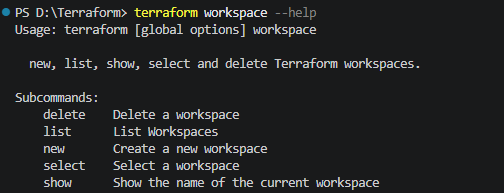

# Terraform Important Concepts

### What is Terraform state?

Terraform state is a snapshot of infrastructure managed by Terraform. It records resource attributes, metadata, and dependencies so Terraform can track real-world resources and detect changes. This state file (typically terraform.tfstate) allows Terraform to plan updates accurately and avoid recreating resources unnecessarily.

State can be stored locally or remotely (e.g., in S3 or Terraform Cloud) for collaboration and security. Remote backends also support state locking to prevent concurrent modifications.

The Terraform state file is named terraform.tfstate by default and is held in the same directory where Terraform is run. It is created after running terraform apply.

This file’s actual content is a JSON-formatted mapping of the resources defined in the configuration to those in your infrastructure. When Terraform is run, it can use this mapping to compare the infrastructure to the code and make any necessary adjustments.

### Storing state files

State files are stored in the local directory where Terraform is run by default. If you are using Terraform for testing or a personal project, this is fine (as long as your state file is secure and backed up!). However, when working on Terraform projects in a team, this becomes a problem because multiple people will need to access the state file.

You should store your state files remotely, not on your local machine! The location of the remote state file can then be referenced using a backendblock in the terraform block (which is usually in the main.tf file).

It is not a good idea to store the state file in source control. This is because Terraform state files contain all data in plain text, which may contain secrets.

```bash
terraform {
  backend "s3" {
    bucket = "my-terraform-start-bucket"
    key = "global/s3/terraform.tfstate"
    region = "us-west-2"
    use_lockfile = true
    
  }
}
```

**Isolating through multiple state files**

A better way is to use multiple state files for parts of your infrastructure. Logically separating resources from each other and giving them their own state file in the backend means that changes to one resource will not affect the other. Different state files for different environments are also a good idea.

---

### What is a Terraform workspace?

Terraform workspaces let you manage multiple deployments of the same configuration. When you create cloud resources using Terraform’s configuration language, they are created in the default workspace. Workspaces are a handy tool for testing configurations, offering flexibility in resource allocation, regional deployments, multi-account deployments, and more.

Terraform stores information about all managed resources in a state file. It is important to store this file in a secure location. Every Terraform run is associated with a state file for validation and reference. Any modifications to the Terraform configuration, whether planned or applied, are validated against the state file first, and the result is updated back to it.

If you are not consciously using a workspace, all of this already happens in the default workspace. Workspaces help you isolate independent deployments of the same Terraform configuration while using the same state file.

### How to use the Terraform workspace command
The terraform workspace command manages multiple state environments within a single configuration, allowing teams to maintain separate infrastructure states for stages like development, staging, and production.

To begin, let’s look at the options available to us in the help:



---

